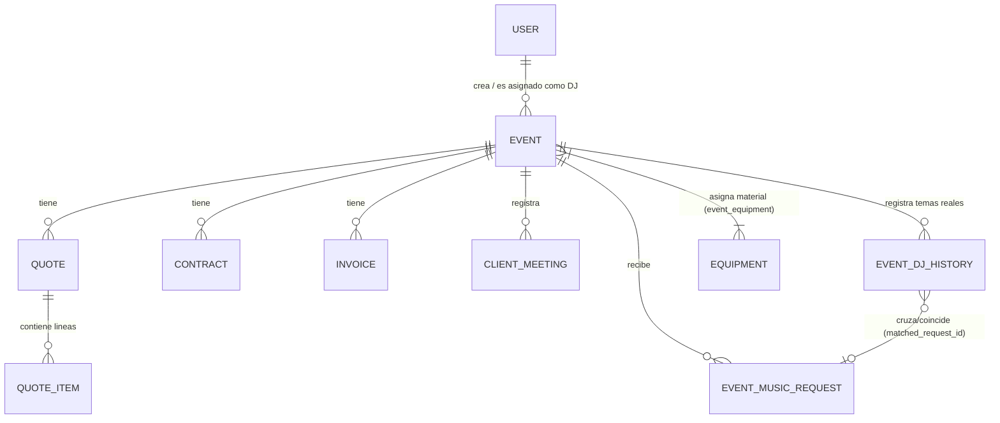

# 💻 MANUAL TÉCNICO Y ARQUITECTURA DEL CÓDIGO
## Sistema de Gestión Integral de Eventos Musicales (Laravel 11 + Livewire 3)

---

## 📑 Índice Técnico
1. [Stack Tecnológico y Arquitectura](#1-stack-tecnológico-y-arquitectura)
2. [Estructura del Proyecto](#2-estructura-del-proyecto)
3. [Modelo de Datos y Base de Datos (Eloquent)](#3-modelo-de-datos-y-base-de-datos-eloquent)
4. [Componentes Reactivos (Livewire 3)](#4-componentes-reactivos-livewire-3)
   - 4.1. `EventShow.php` (Componente Maestro del Evento)
   - 4.2. Componentes de Administración (`Dashboard`, `EventManager`, `InventoryManager`, etc.)
   - 4.3. Portales Públicos (`ContractSign`, `LiveRequests`, `EventForm`, `QuoteCalculator`, `DjBoothMode`)
5. [Capa de Servicios de Negocio (`app/Services`)](#5-capa-de-servicios-de-negocio-appservices)
   - 5.1. `DjHistoryParserService.php` (Motor de Importación y Cruce Musical)
   - 5.2. `ImapLeadFetcherService.php` (Automatización IMAP y Parseo de Leads)
   - 5.3. `SpotifyService.php` y APIs de Música
   - 5.4. `CloudMusicStorageService.php` (Streaming y Archivos)
   - 5.5. `PostalCodeService.php` (Geolocalización y Kilometraje)
   - 5.6. Servicios de Plantillas (`ContractTemplateService`, `WhatsAppTemplateService`, etc.)
6. [Controladores HTTP y Enrutamiento](#6-controladores-http-y-enrutamiento)
   - 6.1. `PdfController.php` (Motor DomPDF de Documentos Oficiales)
   - 6.2. `SpotifyAuthController.php` (Streaming y Proxy de APIs)
   - 6.3. `CalendarFeedController.php` (Sincronizador RFC 5545 iCal)
7. [Comandos de Consola y Cron Jobs](#7-comandos-de-consola-y-cron-jobs)
8. [Seguridad, Auditoría y Tokens Públicos](#8-seguridad-auditoría-y-tokens-públicos)
9. [Guía de Despliegue y Mantenimiento en Servidor](#9-guía-de-despliegue-y-mantenimiento-en-servidor)

---

## 1. Stack Tecnológico y Arquitectura

El proyecto sigue una arquitectura monolítica moderna reactiva, eliminando la necesidad de APIs REST externas complejas para la UI y manteniendo la reactividad en tiempo real mediante WebSockets / AJAX transparentes:

- **Framework Backend**: Laravel 11.x (PHP 8.2+)
- **Capa Reactiva / Frontend**: Livewire 3 + Alpine.js
- **Diseño y Estilos**: Tailwind CSS 3.x
- **Generación de Documentos**: `barryvdh/laravel-dompdf` (DomPDF)
- **Integraciones Externas**:
  - Spotify Web API (Client Credentials / Web Playback SDK)
  - Apple Music API
  - Protocolo IMAP SSL/TLS (extensión PHP `imap` o sockets directos)
  - Estándar de Calendario RFC 5545 (iCalendar)

---

## 2. Estructura del Proyecto

```text
app/
├── Console/
│   └── Commands/
│       └── FetchEmailLeadsCommand.php     # Comando artisan emails:fetch-leads
├── Http/
│   ├── Controllers/
│   │   ├── AuthController.php            # Login / Logout de sesión
│   │   ├── CalendarFeedController.php    # Sincronización iCal (.ics)
│   │   ├── PdfController.php             # Generación de PDFs (Presupuesto, Contrato, Factura, etc.)
│   │   └── SpotifyAuthController.php     # Proxy y streaming de audios
│   └── Middleware/
│       └── IsAdmin.php                   # Filtro de protección de rutas de administración
├── Livewire/
│   ├── Admin/                            # Componentes del panel privado
│   │   ├── AnalyticsManager.php
│   │   ├── CalendarManager.php
│   │   ├── ClientManager.php
│   │   ├── Dashboard.php
│   │   ├── DjBoothMode.php
│   │   ├── EventManager.php
│   │   ├── EventShow.php                 # Ficha principal del evento (10 pestañas)
│   │   ├── InventoryManager.php
│   │   ├── MusicManager.php
│   │   ├── Settings.php
│   │   └── UserManager.php
│   └── Guest/                            # Portales accesibles mediante Token público
│       ├── ContractSign.php              # Firma digital de contratos
│       ├── EventForm.php                 # Formulario de novios (datos y gustos musicales)
│       ├── LiveRequests.php              # Peticiones en vivo por QR
│       └── QuoteCalculator.php           # Calculadora pública de presupuestos
├── Models/                               # Modelos Eloquent ORM
│   ├── ClientMeeting.php                 # Actas de reuniones con clientes
│   ├── Contract.php                      # Contratos y firmas de auditoría
│   ├── Dossier.php                       # Dossier técnico
│   ├── Equipment.php                     # Inventario de equipos y DMX
│   ├── Event.php                         # Modelo nuclear del evento
│   ├── EventDjHistory.php                # Historial de temas pinchados en directo
│   ├── EventMusicRequest.php             # Peticiones de novios e invitados
│   ├── Invoice.php                       # Facturación proforma/definitiva
│   ├── Playlist.php                      # Listas de reproducción
│   ├── Quote.php                         # Presupuestos
│   ├── QuoteItem.php                     # Líneas de presupuesto
│   ├── Setting.php                       # Ajustes de configuración
│   ├── Track.php                         # Temas de la biblioteca general
│   └── User.php                          # Usuarios administradores y staff
└── Services/                             # Lógica de negocio desacoplada
    ├── CloudMusicStorageService.php      # Gestión de audios locales y Google Drive
    ├── ContractTemplateService.php       # Generación de cláusulas legales
    ├── DjHistoryParserService.php        # Parser multiformato (Engine DJ/Rekordbox/M3U)
    ├── DocumentValidationService.php     # Validaciones de integridad
    ├── DossierTemplateService.php        # Plantillas de dossier
    ├── ImapLeadFetcherService.php        # Lector IMAP de correos automáticos
    ├── MusicListImportService.php        # Importador masivo de biblioteca
    ├── MusicSearchService.php            # Motor unificado de búsqueda musical
    ├── PostalCodeService.php             # Cálculo kilométrico y logístico
    ├── SpotifyService.php                # Conexión y caché con Spotify API
    └── WhatsAppTemplateService.php       # Generador de enlaces wa.me
```

---

## 3. Modelo de Datos y Base de Datos (Eloquent)

### Relaciones Principales del Sistema



### Modelos Destacados:

1. **`Event` (`app/Models/Event.php`)**:
   - Campos: `token`, `brand` (`javnxdj` o `nunezandson`), `event_type`, `event_date`, `setup_date`, `start_time`, `end_time`, `dance_start_time`, `status`, `venue_name`, `venue_contact_name`, `venue_contact_phone`, `deposit_amount`, `deposit_paid`, `deposit_paid_at`.
   - Relaciones: `quotes()`, `contracts()`, `invoices()`, `meetings()`, `musicRequests()`, `djHistories()`, `equipment()`.
   - Casts y Accesores: Generación automática de `token` UUID al crear, formato visual de fechas y estados.

2. **`EventDjHistory` (`app/Models/EventDjHistory.php`)**:
   - Guarda el tracklist real importado desde el software de DJ.
   - Campos: `event_id`, `track_number`, `artist`, `title`, `bpm`, `key`, `played_at`, `duration_seconds`, `source_format` (`engine_dj`, `rekordbox`, `serato`, `m3u`, `manual`), `matched_request_id`.
   - Relación: `belongsTo(EventMusicRequest::class, 'matched_request_id')`.

3. **`Contract` (`app/Models/Contract.php`)**:
   - Campos: `signature_data` (Base64 PNG de la firma dibujada), `signed_at`, `signer_ip`, `signer_user_agent`, `audit_certificate_hash`.

4. **`Quote` y `QuoteItem` (`app/Models/Quote.php`, `app/Models/QuoteItem.php`)**:
   - Cálculo automático de base imponible, IVA (21%), total, importe de fianza y métodos de pago aceptados.

---

## 4. Componentes Reactivos (Livewire 3)

### 4.1. `EventShow.php` (`app/Livewire/Admin/EventShow.php`)
Es el componente más completo del sistema. Administra la vista detallada del evento mediante 10 pestañas dinámicas sin recargar la página:
- **Pestaña `overview`**: Cronograma, horarios de montaje y barra libre, contactos clave.
- **Pestaña `budget`**: Creador y editor reactivo de presupuestos con cálculo dinámico de totales e IVA.
- **Pestaña `contracts`**: Generador de contratos legales y comprobación de estado de firma.
- **Pestaña `invoices`**: Emisión de facturas vinculadas a presupuestos aprobados.
- **Pestaña `meetings`**: Registro de actas de reunión y notas de seguimiento.
- **Pestaña `music`**:
  - Escaleta musical interactiva por momentos de la boda.
  - Reproducción de muestras de audio (previews).
  - Modal y lógica de importación de sesiones DJ (`importDjHistory`, `deleteDjHistory`).
  - Buscador reactivo en el historial de temas de la sesión (`djHistoryFilterQuery`).
- **Pestaña `inventory`**: Selector de material del almacén y asignación de universo/canales DMX.
- **Pestaña `dossier`**: Configuración técnica avanzada del evento.
- **Pestaña `history`**: Registro de cambios y auditoría.

### 4.2. Portales Públicos (Guest)
- **`ContractSign.php` (`app/Livewire/Guest/ContractSign.php`)**: Permite al cliente visualizar el contrato renderizado y firmar en un canvas HTML5. Al enviar, captura la IP del cliente y sella el documento digitalmente.
- **`LiveRequests.php` (`app/Livewire/Guest/LiveRequests.php`)**: Portal móvil para invitados con buscador en tiempo real contra Spotify API, límite de peticiones por usuario y envío instantáneo a la cabina.
- **`QuoteCalculator.php` (`app/Livewire/Guest/QuoteCalculator.php`)**: Calculadora de precios con geolocalización por código postal (`PostalCodeService`).
- **`DjBoothMode.php` (`app/Livewire/Admin/DjBoothMode.php`)**: Vista en vivo optimizada para tablets de cabina con tema ultra-dark y actualización automática mediante polling reactivo (`wire:poll.5s`).

---

## 5. Capa de Servicios de Negocio (`app/Services`)

### 5.1. `DjHistoryParserService.php`
Motor especializado en la ingesta de archivos de sesiones de DJ:
- **Formatos soportados**:
  - **Denon Engine DJ CSV**: Detecta cabeceras `#`, `Song Title`, `Artist`, `BPM`, `Key`, `Time Played`, `Duration`.
  - **Pioneer Rekordbox CSV / TXT**: Detecta cabeceras `Track Title`, `Artist`, `BPM`, `Time`.
  - **Serato / Traktor CSV**: Parser adaptativo de columnas.
  - **M3U / M3U8 Playlists**: Lee etiquetas `#EXTINF:segundos,Artista - Título` y rutas de archivo relativas/absolutas.
  - **Texto plano**: Expresiones regulares que separan `[Número.] Artista - Título` o `Título - Artista`.
- **Algoritmo de Cruce con Peticiones (`crossReferenceWithRequests`)**:
  - Aplica normalización de cadenas (elimina tildes, signos de puntuación, mayúsculas y sufijos como `(Radio Edit)`, `(Original Mix)` o extensiones `.mp3`).
  - Realiza matching exacto o de contención mutua (`str_contains`).
  - Aplica cálculo de distancia Levenshtein / `similar_text` (> 80% de similitud).
  - Si hay coincidencia, vincula el ID de la petición y actualiza su estado a `played` ("Sonada en directo").

### 5.2. `ImapLeadFetcherService.php`
Servicio de automatización de captación de leads por correo electrónico:
- Conecta vía `imap_open` (`{mail.dominio.com:993/imap/ssl/novalidate-cert}INBOX`).
- Soporta configuración multi-cuenta (buzón `nunezandson` y buzón `javnxdj`).
- Filtra correos no leídos (`UNSEEN`) y aplica expresiones regulares para extraer:
  - Nombre y apellidos del contacto.
  - Teléfono móvil y correo electrónico.
  - Fecha estimada del evento y lugar/provincia.
  - Comentarios o presupuesto estimado.
- Crea el registro del evento en estado `new`, evitando duplicados basándose en el Message-ID o email/fecha.

### 5.3. `SpotifyService.php`
- Gestiona la autenticación Server-to-Server mediante **OAuth 2.0 Client Credentials Flow**.
- Almacena en caché el `access_token` durante 55 minutos para minimizar llamadas al API de Spotify.
- Métodos clave:
  - `searchTracks($query)`: Búsqueda con límite y filtrado por popularidad.
  - `getTrackDetails($spotifyId)`: Obtiene carátulas en alta resolución, duración y metadatos.
  - `getAudioFeatures($spotifyId)`: Obtiene BPM, escala musical y energía para mezclas armónicas.

### 5.4. `PostalCodeService.php`
- Contiene una base de datos de coordenadas y códigos postales de España.
- Calcula la distancia en línea recta / ruta por carretera desde la sede central hasta la finca del evento.
- Aplica la fórmula de tarificación por kilómetro configurada en los ajustes para repercutir el kilometraje en el presupuesto.

---

## 6. Controladores HTTP y Enrutamiento

### 6.1. `PdfController.php` (`app/Http/Controllers/PdfController.php`)
Controlador encargado de renderizar las vistas Blade optimizadas con DomPDF:
- `downloadQuote(Quote $quote)`: Presupuesto formal.
- `downloadContract(Contract $contract)`: Contrato firmado con certificados e IP.
- `downloadInvoice(Invoice $invoice)`: Factura oficial con numeración fiscal.
- `downloadPackingList(Event $event)`: Hoja de carga de almacén y material técnico.
- `downloadMusicEscaleta(Event $event)`: Escaleta de momentos musicales para el DJ.
- `downloadDjHistory(Event $event)`: Tracklist oficial del setlist que sonó en el evento.

### 6.2. `SpotifyAuthController.php`
- Proporciona endpoints JSON públicos y protegidos:
  - `/api/spotify/token`: Token temporal para el reproductor web en el frontend.
  - `/api/drive-stream/{fileId}`: Proxy para streaming de archivos de audio alojados en Google Drive sin exponer credenciales.
  - `/music/{musicRequest}/download`: Descarga directa de archivos de audio asociados a peticiones.

### 6.3. `CalendarFeedController.php`
- Endpoint `/calendar/feed/{token}.ics`.
- Genera una respuesta con cabecera `Content-Type: text/calendar; charset=utf-8`.
- Renderiza eventos en formato estándar RFC 5545 con campos `SUMMARY`, `DTSTART`, `DTEND`, `LOCATION` y `DESCRIPTION` para suscripción en Google Calendar, Apple Calendar o Outlook.

---

## 7. Comandos de Consola y Cron Jobs

### `php artisan emails:fetch-leads`
- **Archivo**: `app/Console/Commands/FetchEmailLeadsCommand.php`
- **Función**: Ejecuta la revisión periódica de los buzones IMAP configurados en `Settings` para importar automáticamente solicitudes de información de novios y clientes potenciales.
- **Configuración en Crontab / Plesk**:
  ```bash
  * * * * * cd /ruta/del/proyecto && /opt/plesk/php/8.5/bin/php artisan schedule:run >> /dev/null 2>&1
  ```
  O ejecución directa cada 15-30 minutos:
  ```bash
  */15 * * * * /opt/plesk/php/8.5/bin/php /ruta/del/proyecto/artisan emails:fetch-leads
  ```

---

## 8. Seguridad, Auditoría y Tokens Públicos

1. **Tokens Opacos (UUID v4)**:
   - Los eventos disponen de un campo `token` alfanumérico único e irrepetible.
   - Permite que los clientes o invitados accedan a su formulario (`/guest/form/{token}`), firma de contrato (`/contrato/{token}`) o peticiones (`/peticiones/{token}`) sin requerir contraseñas, impidiendo ataques de fuerza bruta por ID numérico secuencial.

2. **Auditoría Legal de Firmas Electrónicas**:
   - Cada firma de contrato almacena:
     - Vector de imagen de la firma en base64.
     - Dirección IP pública (`request()->ip()`).
     - Cabecera User-Agent del dispositivo firmante.
     - Timestamp UTC exacto con milisegundos.
     - Hash de integridad criptográfico del documento.

3. **Protección Middleware**:
   - `auth` + `is_admin`: Garantiza que únicamente usuarios con rol administrador puedan acceder a rutas financieras, configuración, presupuestos e inventario.

---

## 9. Guía de Despliegue y Mantenimiento en Servidor

### Pasos habituales tras actualizar el código (`git pull`):

```bash
# 1. Descargar cambios
git pull origin main

# 2. Ejecutar migraciones pendientes de base de datos
php artisan migrate --force

# 3. Limpiar y optimizar cachés de Laravel
php artisan optimize:clear
php artisan config:cache
php artisan route:cache
php artisan view:cache

# 4. Asegurar enlace simbólico de almacenamiento público
php artisan storage:link
```

### Requisitos de Extensiones PHP recomendadas:
- `php-imap` (Para la lectura automática de correos y leads).
- `php-gd` o `php-imagick` (Para el procesado de imágenes y firmas en PDFs).
- `php-curl`, `php-mbstring`, `php-xml`, `php-sqlite3` / `php-mysql`.
